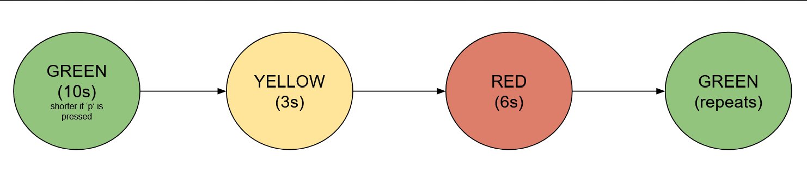

# Simple Traffic Light FSM in C
This program is my final project for ECE2039! I really loved this class! This program features a `main.c` file, a `makefile`, and a `README.md` file.

This program simulates a traffic light, switching from GREEN --> YELLOW --> RED --> GREEN. 

## To compile the program
Open Linux terminal, `cd` into the directory containing the files in this repository.
Enter `make` to compile the finite state machine program and `./main` to run the program.
Enter `./main -h` to open the help dialog to tell you more about the program. 

## Within Simulation
Almost all of the state transitions in this program are driven by the passage of time. Every second, the program prints out its current state, along with the amount of remaining time elapsed before its next state transition.

GREEN state: 10 second duration before transitioning to yellow state
YELLOW State: 3 second duration before transitioning to red state
RED State: 5 second duration before transitioning back to green state

The user can drive a state transition themselves by pressing `p` and `ENTER` on their keyboard to simulate a pedestrian crossing the road. This decreases the GREEN state by 5 seconds and should expedite the transition to the YELLOW state. 

The program will run continuously until the user uses the keybind `Ctrl + C` to exit the program.

## State Diagram
